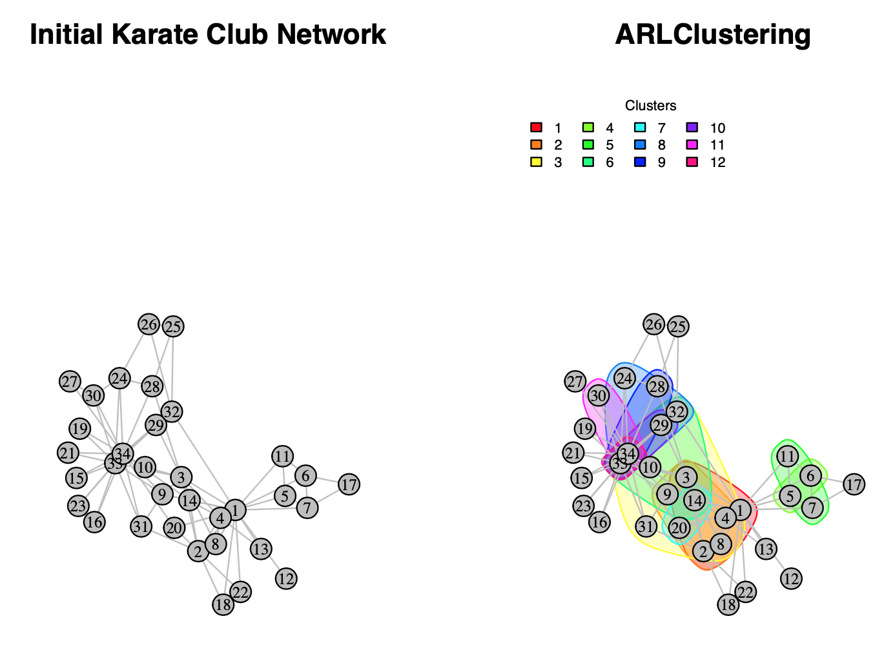

# ARLClustering Package

`ARLClustering` is an R package designed for network data analysis, leveraging association rules to examine node interactions within networks. This package introduces a novel approach to community detection using data-mining techniques to highlight communities within the social network.

## Key Features:

-   **Community Detection**: Implements an innovative method for identifying communities within a network through association rule learning.
-   **Synthetic Datasets**: Includes synthetic social network datasets for testing and validating the effectiveness of the proposed approach. The following are the used datasets:
    -   Karate Club social network: N=34; E=78
    -   Dolphins social network: N=62; E=159
    -   LesMiserables social network: N=77; E=254
    -   Word Adjacencies social network: N=112; E=425
    -   Facebook L1 Organization: N=5793; E=45266
    -   NetScience network: N=1589; E=2742
    -   Facebook Friend social network: N=362; E=1988
-   **Step-by-Step Implementation**: Guides users through the entire process, from loading the network dataset to identifying potential clusters.

## **Overview**

Community detection is a critical aspect of network analysis, providing insights into the modular structure of networks. **`ARLClustering`** package enhances this process by applying data-mining techniques to uncover hidden patterns and relationships among nodes. It provides functions to preprocess network data, generate association rules, and identify clusters within the network based on these rules.

This package is particularly useful for researchers and practitioners in fields such as social network analysis, biology, and communication networks, who require useful tools for applying their community detection analysis.

## Installation

You can install the `ARLClustering` package directly from GitHub using the `devtools` package:

``` r
devtools::install_github("assuom44/arlclustering")
```

## Functions

An overview of the main functions provided by the `ARLClustering` package:

-   `get_network_dataset():`Loads a network dataset and converts it into a graph object.

-   `arlc_gen_transactions():`Generates a transactional dataset from a graph for association rule mining.

-   `arlc_get_apriori_thresholds():`Finds the best thresholds for the `Apriori` algorithm based on the provided dataset.

-   `arlc_gen_gross_rules():`Executes the `Apriori` algorithm to generate gross association rules.

-   `arlc_get_NonR_rules():`Eliminate non redundant rules from the gross rules generated from previous step.

-   `arlc_get_significant_rules():`Choose significant rules from the non redundant rules generated from previous step.

-   `arlc_clean_final_rules():`Cleans the pre-processed rules to remove redundancy and insignificance.

-   `arlc_generate_clusters():`Generates potential clusters based on the pre-processed rules.

-   `arlc_clusters_plot():`Displays the obtained result as a plot if the total number of nodes less than 70. Otherwise, it displays the list of the identified communities.

## **Example Usage**

Here is examples of the `arlc_get_network_dataset` call for each of the provided synthetic network datasets, the network is loaded then on variable `g`:

``` r
dataset_path <- system.file("extdata", "karate.gml", package = "arlclustering")
g <- arlc_get_network_dataset(dataset_path, "Karate Club")

dataset_path <- system.file("extdata", "dolphins.gml", package = "arlclustering")
g <- arlc_get_network_dataset(dataset_path, "Dolphins Network")

dataset_path <- system.file("extdata", "lesmiserables.gml", package = "arlclustering")
g <- arlc_get_network_dataset(dataset_path, "LesMiserables Network")

dataset_path <- system.file("extdata", "word_adjacencies.gml", package = "arlclustering")
g <- arlc_get_network_dataset(dataset_path, "Word Adjacencies Network")

dataset_path <- system.file("extdata", "netscience.gml", package = "arlclustering")
g <- arlc_get_network_dataset(dataset_path, "NetScience Network")

dataset_path <- system.file("extdata", "Facebook_fiends.gml", package = "arlclustering")
g <- arlc_get_network_dataset(dataset_path, "Facebook-friends Network")

dataset_path <- system.file("extdata", "Facebook_Org_L1.gml", package = "arlclustering")
g <- arlc_get_network_dataset(dataset_path, "Facebook-L1-org Network")
```

Generating the transactions into the variable trx:

``` r
trx <- arlc_gen_transactions(g$graph)
```

Getting the `apriori` parameters, the computed parameters will be used for generating the best rule set. Here is an example of each of the provided dataset examples:

``` r
-- Kerate
params <- arlc_get_apriori_thresholds(trx, supportRange = seq(0.1, 0.2, by = 0.1), 0.5)

-- Dolphins
params <- arlc_get_apriori_thresholds(trx, supportRange = seq(0.05, 0.06, by = 0.01), 0.5)

-- LesMiserables
params <- arlc_get_apriori_thresholds(trx, supportRange = seq(0.04, 0.05, by = 0.01), 0.5)

-- WordAdjacency
params <- arlc_get_apriori_thresholds(trx, supportRange = seq(0.03, 0.04, by = 0.01), 0.5)

-- NetScience
params <- arlc_get_apriori_thresholds(trx, supportRange = seq(0.011, 0.012, by = 0.001), 0.5)

-- Facebook-Freinds
params <- arlc_get_apriori_thresholds(trx, supportRange = seq(0.04, 0.05, by = 0.01), 0.5)

-- Facebook-L1-Organization
params <- arlc_get_apriori_thresholds(trx, supportRange = seq(0.05, 0.06, by = 0.01), 0.5)
```

Generating the gross rules using the computed `apriori` parameters. The result is stored in the the variable `grossRules`:

``` r
grossRules <- arlc_gen_gross_rules(trx, minSupp = params$minSupp, minConf = params$minConf, minLenRules = 1, maxLenRules = params$lenRules)
```

Filtering the generated gross rules through non redundant and significant rules. The final result is stored in the variable `NonRSigRules`:

``` r
NonRedRules <- arlc_get_NonR_rules (grossRules$GrossRules)
```

``` r
NonRSigRules <- arlc_get_significant_rules (trx, NonRedRules$FiltredRules)
```

Cleaning the obtained result:

``` r
cleanedRules <- arlc_clean_final_rules (NonRSigRules$FiltredRules)
```

Generating clusters:

``` r
c <- arlc_generate_clusters (cleanedRules) 
```

Displaying results:

``` r
arlc_clusters_plot(g$graph, g$graphLabel, c$Clusters)
```

In case the total number of nodes is less than 100 nodes, a plot of the `ARLClustering` communities will be generated, otherwise only a display of the list of Sets (communities) will be proposed.

-   *`ARLClustering`'s outputs for Karate Club social network:*



Total Identified Clusters: 5

`=========================`

`Community  01 : 1 2 3 4 8 14`

`Community  02 : 2 3 4 8 9 14`

`Community  03 : 3 4 8 14 31 32 34`

`Community  04 : 5 6`

`Community  05 : 7 11`

`Community  06 : 9 14 32 33`

`Community  07 : 14 20`

`Community  08 : 24 32 34`

`Community  09 : 28 33`

`Community  10 : 29 33`

`Community  11 : 30 34`

`Community  12 : 33 34`

`=========================`

## Contribution

Contributions to the `ARLClustering` package are welcome! If you encounter any issues or have suggestions for improvements, please feel free to open an issue or submit a pull request on GitHub.

## **License**

`ARLClustering` is released under the GPL-3 license.
